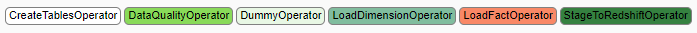
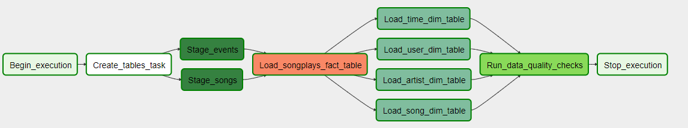
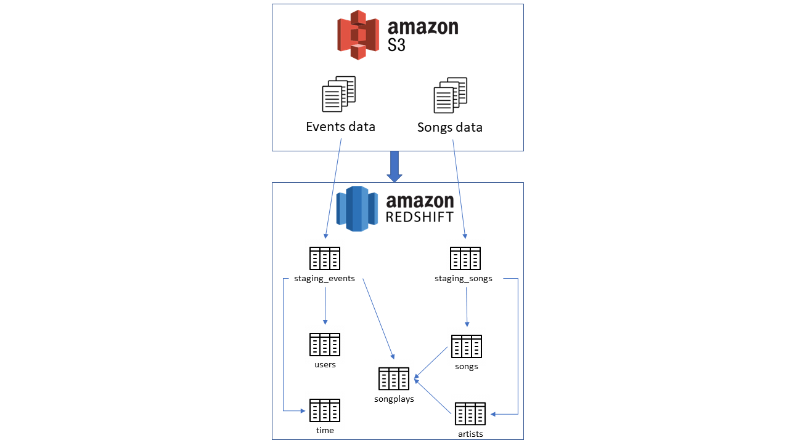

# Project Summary
## Introduction
A music streaming company, Sparkify, has decided that it is time to introduce more automation and monitoring to their 
data warehouse ETL pipelines and come to the conclusion that the best tool to achieve this is Apache Airflow.

They have decided to bring you into the project and expect you to create high grade data pipelines that are dynamic and 
built from reusable tasks, can be monitored, and allow easy backfills. They have also noted that the data quality plays 
a big part when analyses are executed on top the data warehouse and want to run tests against their datasets after the 
ETL steps have been executed to catch any discrepancies in the datasets.

The source data resides in S3 and needs to be processed in Sparkify's data warehouse in Amazon Redshift. The source 
datasets consist of JSON logs that tell about user activity in the application and JSON metadata about the songs the 
users listen to.

## Description
The project deploys Apache Airflow for automating and orchestrating Sparkify Data pipeline, it creates custom operators
to perform tasks such as creating tables, staging the data from S3 bucket `s3://udacity-dend/song-data` and 
`s3://udacity-dend/log-data`, filling the data warehouse, and running checks on the data as the final steps. 

The Python scripts take care all the imports and provides five empty operators that need to be implemented 
into functional pieces of a data pipeline.

## Database design in STAR schema


## Sparkify DAG



## AWS services architecture


# Running the Data Pipeline
## Step 1: Clone the Python scripts to the machine contains all the available Airflow configurations 
```commandline
git clone https://<YOUR_PERSONAL_ACCESS_TOKEN>>@github.com/xzbits/Project5_Sparkify_Airflow_ND.git
```

## Step 2: Start the Airflow UI
Go to `Admin` --> `Connections`

### Step 2.1: Create new connection to Amazon Web Service
* Conn Id: Enter `aws_credentials`.
* Conn Type: Enter `Amazon Web Services`.
* Login: Enter your `Access key ID` from the IAM User credentials you downloaded earlier.
* Password: Enter your `Secret access key` from the IAM User credentials you downloaded earlier. Once you've entered 
these values, select Save.

### Step 2.2: Create new connection to cluster Postgre database
* Conn Id: Enter `redshift`.
* Conn Type: Enter `Postgres`.
* Host: Enter the endpoint of your Redshift cluster, excluding the port and schema name at the end. You can find this by 
selecting your cluster in the Clusters page of the Amazon Redshift console. See where this is located in the screenshot 
below. IMPORTANT: Make sure to NOT include the port and schema name at the end of the Redshift endpoint string.
* Schema: Enter `dev`. This is the Redshift database you want to connect to.
* Login: Enter `awsuser`.
* Password: Enter the password you created when launching your Redshift cluster.
Port: Enter `5439`. Once you've entered these values, select Save.
  
## Step 3: Switch ON your Sparkify DAG to execute the data pipeline
The DAG is scheduled to run hourly. Finally, the `start_date` is in the past (`datetime(2019, 1, 12)`). Therefore, it 
will automatically backfill when the Sparkify is triggered.

# Repository
## `s3://udacity-dend` S3 Bucket
The `s3://udacity-dend` S3 Bucket has 2 separate folders, 
* The `song_data` folder includes all JSON files need for `staging_songs`, `songs` and `artists` tables.
* The `log_data` folder includes all JSON files need for `staging_events`, `users`, and `time` tables.
```
└── s3://udacity-dend
    ├── log_data
    │   └── 2018
    │       └── 11
    │           ├── 2018-11-01-events.json
    │           ├── 2018-11-02-events.json
    │           └── ...
    └── song_data
        ├── A
        │   ├── A
        │   │   ├── A
        │   │   │   ├── TRAAAAW128F429D538.json
        │   │   │   ├── TRAAABD128F429CF47.json
        │   │   │   └── ...
        │   │   ├── B
        │   │   │   ├── TRAABCL128F4286650.json
        │   │   │   ├── TRAABDL12903CAABBA.json
        │   │   │   └── ...
        │   │   └── C
        │   │       ├── TRAACCG128F92E8A55.json
        │   │       ├── TRAACER128F4290F96.json
        │   │       └── ...
        │   └── B
        │       ├── A
        │       │   ├── TRABACN128F425B784.json
        │       │   ├── TRABAFJ128F42AF24E.json
        │       │   └── ...
        │       ├── B
        │       │   ├── TRABBAM128F429D223.json
        │       │   ├── TRABBBV128F42967D7.json
        │       │   └── ...
        │       └── C
        │           ├── TRABCAJ12903CDFCC2.json
        .           ├── TRABCEC128F426456E.json
        .           └── ...
        .

```
